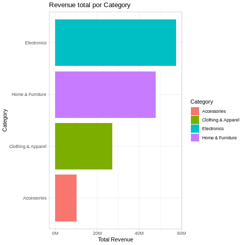
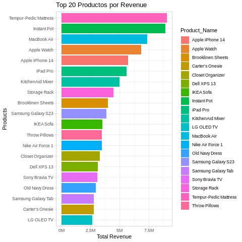
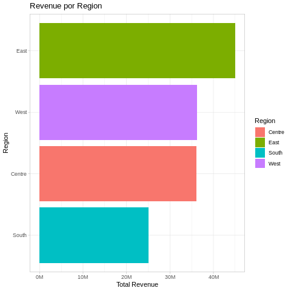
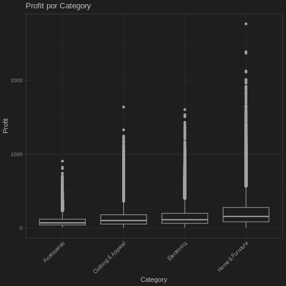
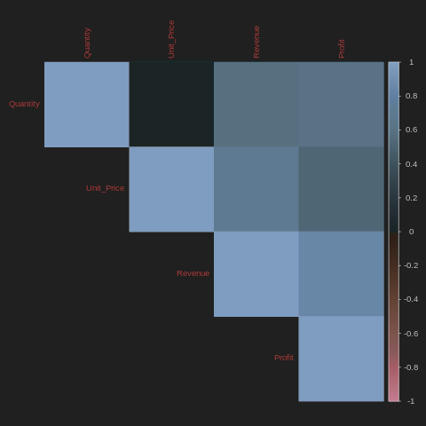

# Análisis Exploratorio de Datos (EDA) - Product Sales Dataset 2023-2024

## 📊 Descripción del Dataset

Este proyecto utiliza el dataset **Product Sales Dataset 2023-2024** disponible en Kaggle, que contiene información detallada sobre ventas de productos durante el período 2023-2024.

### Características del Dataset

El dataset incluye las siguientes variables principales:

- **Order_Date**: Fecha de la orden (formato MM-DD-YY)
- **Customer_Name**: Nombre del cliente
- **Product_Name**: Nombre del producto vendido
- **Category**: Categoría principal del producto
- **Sub_Category**: Subcategoría del producto
- **Region**: Región geográfica de la venta
- **Quantity**: Cantidad de unidades vendidas
- **Unit_Price**: Precio unitario del producto
- **Revenue**: Ingresos totales generados
- **Profit**: Beneficio obtenido de la venta

---

## 🔧 Trabajo Realizado

### 1. **Preparación del Entorno**
- Configuración de R en Google Colab mediante rpy2
- Instalación de librerías necesarias: `dplyr`, `ggplot2`, `tidyr`, `lubridate`, `corrplot`
- Descarga automática del dataset desde Kaggle

### 2. **Análisis Exploratorio de Datos**
- **Exploración inicial**: Análisis de dimensiones, tipos de datos y estructura del dataset
- **Análisis de valores faltantes**: Identificación y cuantificación de datos perdidos
- **Estadísticas descriptivas**: Cálculo de media, mediana, mínimo y máximo para variables numéricas
- **Análisis de distribuciones**: Visualización de distribuciones de Revenue y Profit

### 3. **Procesamiento de Datos**
- **Conversión de fechas**: Transformación del campo Order_Date a formato Date
- **Extracción de características temporales**: Creación de variables Year, Month y Day
- **Validación de datos**: Verificación de la correcta conversión de fechas

### 4. **Feature Engineering**
Se crearon las siguientes variables derivadas:
- **Profit_Margin**: Margen de beneficio (Profit/Revenue)
- **Cost**: Costo del producto (Revenue - Profit)
- **Revenue_per_Unit**: Ingreso por unidad (Revenue/Quantity)
- **Revenue_Level**: Clasificación en cuartiles (Muy Bajo, Bajo, Medio, Alto)
- **Cumulative_Rev**: Ventas acumuladas por cliente

### 5. **Visualización de Datos**
Generación de 9 gráficas representativas usando ggplot2 para identificar patrones y tendencias

### 6. **Exportación de Resultados**
- Guardado del dataset procesado con todas las nuevas características
- Archivo generado: `product_sales_dataset_processed.csv`

---

## 📈 Las 5 Gráficas Más Representativas

### 1. **Revenue Total por Categoría**

<div align="center">
  
</div>

```r
p3 <- df %>%
  group_by(Category) %>%
  summarize(TotalRev = sum(Revenue, na.rm = TRUE)) %>%
  ggplot(aes(x = reorder(Category, TotalRev), y = TotalRev, fill = Category)) +
  geom_bar(stat='identity') +
  coord_flip() +
  theme_light() +
  ggtitle('Revenue total por Category')
```

**Análisis**: Este gráfico de barras horizontales muestra la contribución de cada categoría de producto al revenue total. Permite identificar rápidamente cuáles son las categorías más rentables del negocio y dónde se concentra la mayor parte de los ingresos. Las categorías se ordenan de mayor a menor revenue, facilitando la comparación y la toma de decisiones estratégicas sobre qué líneas de producto priorizar.

---

### 2. **Top 20 Productos por Revenue**

<div align="center">
  
</div>

```r
top_products <- df %>%
  group_by(Product_Name) %>%
  summarize(TotalRev = sum(Revenue, na.rm = TRUE)) %>%
  arrange(desc(TotalRev)) %>%
  head(20)

p5 <- ggplot(top_products,
             aes(x = reorder(Product_Name, TotalRev), y = TotalRev, fill = Product_Name)) +
  geom_bar(stat='identity') +
  coord_flip() +
  theme_light() +
  ggtitle('Top 20 Productos por Revenue')
```


**Análisis**: Esta visualización identifica los 20 productos estrella que generan más ingresos. Es fundamental para entender qué productos específicos impulsan las ventas y cuáles merecen mayor atención en términos de inventario, marketing y promoción. La brecha entre el producto más vendido y los siguientes también revela la concentración de ventas en productos específicos versus una distribución más equitativa.

---

### 3. **Revenue por Región**

<div align="center">
  
</div>

```r
p6 <- df %>%
  group_by(Region) %>%
  summarize(TotalRev = sum(Revenue, na.rm = TRUE)) %>%
  ggplot(aes(x = reorder(Region, TotalRev), y = TotalRev, fill = Region)) +
  geom_bar(stat='identity') +
  coord_flip() +
  theme_light() +
  ggtitle('Revenue por Region')
```

**Análisis**: Este gráfico muestra el desempeño de ventas por región geográfica, permitiendo identificar mercados fuertes y débiles. Es crucial para la planificación de expansión, asignación de recursos de marketing regional y identificación de oportunidades de crecimiento. Las regiones con menor revenue pueden indicar mercados sin explotar o áreas que requieren estrategias de ventas específicas.

---

### 4. **Distribución de Profit por Categoría (Boxplot)**

<div align="center">
  
</div>

```r
p8 <- ggplot(df, aes(x = Category, y = Profit)) +
  geom_boxplot() +
  theme_light() +
  ggtitle('Profit por Category') +
  theme(axis.text.x = element_text(angle = 45, hjust = 1))
```

**Análisis**: Los boxplots revelan no solo el profit promedio por categoría, sino también la variabilidad y presencia de valores atípicos. Permite identificar categorías con margins más estables versus aquellas con alta variabilidad en rentabilidad. Los outliers pueden indicar productos excepcionales o problemas de pricing. Esta visualización es esencial para entender la salud financiera de cada categoría más allá del revenue bruto.

---

### 5. **Matriz de Correlación (Variables Numéricas)**

<div align="center">
  
</div>

```r
num_df <- df %>% select(Quantity, Unit_Price, Revenue, Profit)
corr_mat <- cor(num_df, use = 'complete.obs')
corrplot(corr_mat, method = 'color', type = 'upper', tl.cex = 0.8)
```

**Análisis**: La matriz de correlación visualiza las relaciones entre las variables numéricas clave del negocio. Muestra cómo Quantity, Unit_Price, Revenue y Profit se relacionan entre sí. Por ejemplo, una alta correlación entre Revenue y Profit indica márgenes consistentes, mientras que la relación entre Quantity y Revenue revela si las ventas se impulsan por volumen o por precio. Esta visualización es fundamental para modelado predictivo y comprensión de la dinámica del negocio.

---

## 🛠️ Tecnologías Utilizadas

- **Lenguaje**: R (ejecutado en Google Colab mediante rpy2)
- **Librerías principales**:
  - `dplyr` y `tidyr`: Manipulación de datos
  - `ggplot2`: Visualización de datos
  - `lubridate`: Manejo de fechas
  - `corrplot`: Matriz de correlación
- **Entorno**: Google Colab con soporte para R
- **Fuente de datos**: Kaggle API

---

## 📁 Estructura del Proyecto

```
eda/
├── plots/                     # Carpeta con las gráficas del análisis
│   ├── revenue_por_categoria.png
│   ├── top20_productos.png
│   ├── revenue_por_region.png
│   ├── profit_por_categoria_boxplot.png
│   └── matriz_correlacion.png
├── EDA_sales_dataset.ipynb    # Notebook principal con el análisis completo
├── README.md                   # Este archivo
├── INSTRUCCIONES_IMAGENES.md   # Guía para guardar las imágenes
└── product_sales_dataset_processed.csv  # Dataset procesado (generado tras ejecución)
```

---

## 🚀 Cómo Ejecutar el Proyecto

1. **Abrir en Google Colab**: Sube el archivo `EDA_sales_dataset.ipynb` a Google Colab
2. **Configurar Kaggle API**: 
   - Descarga tu archivo `kaggle.json` desde tu cuenta de Kaggle
   - Súbelo a `/content/sample_data/kaggle.json` en Colab
3. **Ejecutar las celdas**: Ejecuta todas las celdas en orden secuencial
4. **Revisar resultados**: Las gráficas se generarán automáticamente y el dataset procesado se guardará en `/content/`

---

## 📌 Conclusiones Principales

1. **Concentración de ingresos**: Ciertas categorías y productos específicos dominan el revenue total
2. **Variabilidad regional**: Existen diferencias significativas en el desempeño por región
3. **Márgenes de beneficio**: Los boxplots revelan variabilidad en rentabilidad entre categorías
4. **Relaciones clave**: Las correlaciones entre variables numéricas ayudan a comprender los drivers del negocio
5. **Calidad de datos**: El dataset requirió procesamiento de fechas pero no presenta valores faltantes significativos

---

## 👤 Autor

Samuel Sánchez Heredia

---

## 📝 Licencia

Dataset original disponible en: [Kaggle - Product Sales Dataset 2023-2024](https://www.kaggle.com/datasets/yashyennewar/product-sales-dataset-2023-2024)

